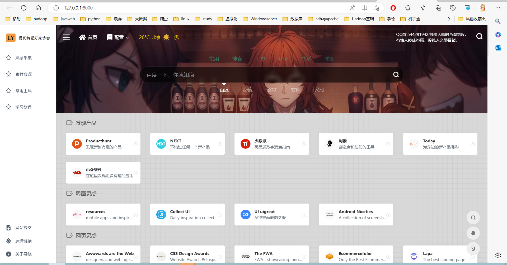

<<<<<<< HEAD
# WebStack  Django版网站导航

🌏 基于 DjangoStarter/WebStack 开发的网站导航

Demo: https://www.longyu.cool


## Features

- 美观的导航界面 基于 [WebStack主题制作](https://github.com/WebStackPage/WebStackPage.github.io)
- 完善后台管理功能
- 网站分类和子分类管理


## 技术

- 后端基于: [DjangoStarter](https://github.com/Deali-Axy/DjangoStarter)

- 前端模板: Bootstrap/AdminLTE/[WebStack主题制作](https://github.com/WebStackPage/WebStackPage.github.io),完全照搬

- python3.10以上,我是用的3.10和3.11

- django4+ (requirements.txt里都会有,应该只要兼容就能用)


## Screenshots

### 主页


### 管理后台

网站分类


编辑网站列表


## LICENSE

```
Apache License Version 2.0, January 2004
http://www.apache.org/licenses/
```

## 食用方法

```shell
git clone https://gitee.com/longyu8/daohang.git
npm install
python install -r requirements.txt

```

然后运行就可以拉,再报错就看看版本之类的吧
=======
# WebStack  Django版网站导航

🌏 基于 DjangoStarter/WebStack 开发的网站导航

Demo: https://www.longyu.cool


## Features

- 美观的导航界面 基于 [WebStack主题制作](https://github.com/WebStackPage/WebStackPage.github.io)
- 完善后台管理功能
- 网站分类和子分类管理


## 技术

- 后端基于: [DjangoStarter](https://github.com/Deali-Axy/DjangoStarter)

- 前端模板: Bootstrap/AdminLTE/[WebStack主题制作](https://github.com/WebStackPage/WebStackPage.github.io),完全照搬

- python3.10以上,我是用的3.10和3.11

- django4+ (requirements.txt里都会有,应该只要兼容就能用)


## Screenshots

### 主页



### 管理后台

网站分类


编辑网站列表


## LICENSE

```
Apache License Version 2.0, January 2004
http://www.apache.org/licenses/
```

## 食用方法

```shell
git clone https://gitee.com/longyu8/daohang.git
npm install
python install -r requirements.txt

```

然后运行就可以拉,再报错就看看版本之类的吧
>>>>>>> 5545685d3ecde3537d6d18834750fdcb53f5434c
